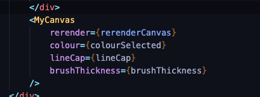

# browser-drawing-tool

A small canvas so you can channel your inner Picasso for a moment.

# Implementing

- Import in your code (default exported)

- In the example it is imported as MyCanvas

- Pass brushThickness: int(1..30), colour: string('black','red' ...), lineCap: string props('round', 'square') to define the brush properties
